# Authentication, KYC, FIDO2, and Transfer System Design

This document describes the current implementation across the mobile app and backend for:
- Login and registration
- KYC onboarding and verification
- FIDO2/passkeys and device key cryptography
- TOTP and push-based authorization
- Transfer authorization and execution
- Security controls, data storage, and hardening priorities

---

## 1) System Overview

### Backend services
- Entry point: `backend/app/main.py`
- Key routers:
  - `backend/app/routers/customers.py`
  - `backend/app/routers/kyc.py`
  - `backend/app/routers/device_auth.py`
  - `backend/app/routers/fido2.py`
  - `backend/app/routers/totp.py`
  - `backend/app/routers/push_auth.py`
  - `backend/app/routers/transactions.py`
- Persistence adapter: `backend/app/db/firestore_client.py`

### Mobile app modules
- Session/auth context: `mobile/src/context/AuthContext.tsx`
- Auth UI:
  - `mobile/src/screens/LoginScreen.tsx`
  - `mobile/src/screens/RegisterScreen.tsx`
  - `mobile/src/screens/DeviceChangeScreen.tsx`
- KYC UI:
  - `mobile/src/screens/KYCBvnScreen.tsx`
  - `mobile/src/screens/KYCCaptureScreen.tsx`
- Transfer UI:
  - `mobile/src/screens/TransferScreen.tsx`
  - `mobile/src/screens/ReviewScreen.tsx`
  - `mobile/src/screens/TransactionPinScreen.tsx`
- Crypto and auth integrations:
  - `mobile/src/lib/deviceKey.ts`
  - `mobile/src/lib/passkeyNative.ts`
  - `mobile/src/lib/totp.ts`
  - `mobile/src/lib/totpSecureStore.ts`
  - `mobile/src/lib/pushNotifications.ts`

---

## 2) Identity and Authentication Flows

## 2.1 Registration (Exact Flow)

1. **Trigger (Mobile UI)**: User submits registration form in `RegisterScreen`.
2. **Network Call**: App sends `POST /api/customers/register` with user profile payload.
3. **Backend Handling**: `backend/app/routers/customers.py::register` validates and creates customer + account.
4. **DB Writes**: Customer record and account record are created via `firestore_client.py`.
5. **Response**: Backend returns created identity/account metadata.
6. **Local Persistence**: `AuthContext.tsx` stores identifiers/session context in `expo-secure-store`.
7. **Post-Registration Branch**: App routes user to KYC and optional device/passkey setup.

Notes:
- Current backend registration/login implementation has PoC constraints described in section 10.
- KYC status handling has a known inconsistency (also in section 10).

---

## 2.2 Username Login (Exact Flow)

1. **Trigger (Mobile UI)**: User enters credentials in `LoginScreen`.
2. **Network Call**: App sends `POST /api/customers/login`.
3. **Backend Handling**: `customers.py::login` resolves identity by username.
4. **Response**: Backend returns customer identity/profile fields.
5. **Local Persistence**: `AuthContext.tsx` stores customer/session values in SecureStore.
6. **App State**: Navigation moves into authenticated area.

Security caveat:
- Password verification is not fully enforced server-side in current code (section 10).

---

## 2.3 Biometric Device-Key Login (Ed25519 or Hardware-Backed, Exact Flow)

**Configuration**: The implementation supports two modes controlled by `EXPO_PUBLIC_DEVICE_KEY_IMPL` environment variable:
- `'ed25519'` (default): Software implementation using @noble/ed25519
- `'hardware'`: Hardware-backed implementation using react-native-biometrics

### Software Path (ED25519)
1. **Key Enrollment Check**: App checks if a device keypair already exists in SecureStore.
2. **If No Key Exists (Generation Point)**:
   - `mobile/src/lib/deviceKey.ts` generates Ed25519 keypair in app JS/runtime (`@noble/ed25519`).
   - Private key is saved to `expo-secure-store`.
   - Public key is registered to backend via `POST /api/device-auth/register`.
3. **User Login Attempt**:
   - User passes local biometric prompt (`expo-local-authentication`).
   - App requests challenge: `POST /api/device-auth/challenge`.
4. **Signing**:
   - App reads private key from SecureStore.
   - App signs challenge bytes locally using @noble/ed25519.
5. **Verification**:
   - App sends signature + metadata to `POST /api/device-auth/verify`.
   - Backend validates signature with stored public key and records auth event.
6. **Success Path**:
   - App marks session authenticated and continues navigation.

### Hardware Path (Platform Biometrics/Keystore)
1. **Key Enrollment Check**: App checks if a hardware device keypair exists via `react-native-biometrics`.
2. **If No Key Exists (Generation Point)**:
   - `mobile/src/lib/deviceKey.ts::generateAndStoreHardwareKey()` creates keypair via platform authenticator.
   - On iOS: Secure Enclave-backed (when available).
   - On Android: Hardware Keystore-backed (when available).
   - Public key is stored in SecureStore for reference and registered to backend via `POST /api/device-auth/register`.
3. **User Login Attempt**:
   - User passes biometric prompt presented by platform.
   - App requests challenge: `POST /api/device-auth/challenge`.
4. **Signing**:
   - `react-native-biometrics` handles signing operation with biometric/PIN gating.
   - Private key never leaves the secure hardware context.
5. **Verification**:
   - App sends signature + metadata to `POST /api/device-auth/verify`.
   - Backend validates signature with stored public key and records auth event.
6. **Success Path**:
   - App marks session authenticated and continues navigation.

Secure Enclave/Keystore status for this flow:
- **Software path (ED25519)**: SecureStore provides encrypted at-rest storage but is not Secure Enclave-backed key generation/signing.
- **Hardware path (Platform Biometrics)**: Private keys are generated and held by platform secure hardware (iOS Secure Enclave, Android Hardware Keystore). App code does not access raw private key material. This provides the strongest cryptographic binding.

---

## 2.4 Passkey Login (FIDO2/WebAuthn, Exact Flow)

1. **Trigger (Mobile UI)**: User chooses passkey sign-in.
2. **Begin Request**: App calls `POST /api/fido2/authenticate/begin`.
3. **Backend Challenge Build**: `fido2.py::authenticate_begin` issues WebAuthn assertion options/challenge.
4. **OS Authenticator Step**:
   - `react-native-passkey` invokes platform authenticator UI.
   - User verifies with biometric/PIN.
   - Authenticator signs challenge with passkey private key.
5. **Complete Request**: App posts assertion to `POST /api/fido2/authenticate/complete/{customer_id}`.
6. **Backend Verify**: `fido2.py::authenticate_complete` verifies assertion against stored credential/public key.
7. **Outcome**: Backend returns success/failure; app updates auth state.

Secure Enclave/Keystore status for this flow:
- Passkey private keys are generated and held by the platform authenticator.
- On iOS, this is typically Secure Enclave-backed when supported by the authenticator class.
- App code does not access raw passkey private key material.

---

## 3) KYC Flows

## 3.1 KYC Onboarding (Reference Capture)

### Mobile
1. BVN capture/entry in `KYCBvnScreen`.
2. Face image capture in `KYCCaptureScreen`.
3. Upload to `POST /api/kyc/onboard`.

### Backend
1. Stores and optionally compresses reference image.
2. Marks customer KYC status fields in storage.

---

## 3.2 KYC Verify (Liveness + Face Match)

### Mobile
1. New selfie capture in `KYCCaptureScreen` verify mode.
2. Submit to `POST /api/kyc/verify`.

### Backend
1. Runs spoof/liveness check first.
2. Runs face match against stored reference.
3. Returns verification decision + metadata.

---

## 4) Transfer Design and Authorization

## 4.1 Transfer Lifecycle (Exact Flow)

1. **Initiate (TransferScreen)**:
   - User enters transfer details.
   - App performs beneficiary lookup and front-end validation.
2. **Precondition Checks**:
   - App fetches/uses KYC status and limit values.
   - UI blocks or continues based on returned status.
3. **Review Step (ReviewScreen)**:
   - User reviews amount/beneficiary/narration.
4. **Transaction Authorization (if enabled path selected)**:
   - Device-key mode:
     1. `POST /api/device-auth/transaction-challenge`
     2. App signs tx challenge with device private key
     3. `POST /api/device-auth/transaction-verify`
   - FIDO2 mode:
     1. `POST /api/fido2/transaction/initiate`
     2. OS passkey assertion prompt
     3. `POST /api/fido2/transaction/authorize`
5. **PIN Step (Current UX Layer)**:
   - `TransactionPinScreen` collects PIN as an app flow step.
6. **Execution Call**:
   - App sends `POST /api/transactions/transfer` with transfer payload and optional authorization `state_id`.
7. **Backend Execution**:
   - `transactions.py::transfer` validates authorization state (if provided), then calls DB-layer transfer execution.
8. **DB Mutation and Audit**:
   - Balances and transaction artifacts are updated in Firestore.
   - Audit records are written.
9. **Response/UX**:
   - App presents success/failure with resulting transaction details.

## 4.2 Backend Transfer Controls

Transfer execution in `transactions.py` / `firestore_client.py` includes:
- KYC-complete checks
- Sufficient balance checks
- Daily/per-transaction limits
- Beneficiary validity checks
- No-self-transfer control
- Optional authorized transaction state consumption (`state_id`)
- Audit log writes

---

## 5) Cryptographic Key Management

### Configuration: Device-Key Implementation Modes

The device-key implementation supports two modes controlled by the `EXPO_PUBLIC_DEVICE_KEY_IMPL` environment variable:

| Mode | Variable Value | Key Generation | Key Storage | Signing | Platform Support | Use Case |
|------|---|---|---|---|---|---|
| **Software (ED25519)** | `'ed25519'` (default) | App JS runtime (@noble/ed25519) | expo-secure-store | @noble/ed25519 in-app | iOS, Android, Expo Go | Development, Expo Go, testing, fallback |
| **Hardware-Backed** | `'hardware'` | Platform authenticator (Secure Enclave / Keystore) | Platform secure hardware | Platform authenticator (biometric-gated) | iOS 10.3+, Android 6.0+ | Production native builds |

**Selection Logic** (from deviceKey.ts):
- If `EXPO_PUBLIC_DEVICE_KEY_IMPL === 'hardware'`, use hardware mode with `react-native-biometrics`.
- Otherwise, default to ED25519 software mode.
- Hardware mode requires a native Expo development build or EAS build (not Expo Go).

---

## 5) Cryptographic Key Management

## 5.1 Device-Key Model (Ed25519 or Hardware-Backed)

### Generation Mode: Software (ED25519)
- Generated on-device in JS layer (`@noble/ed25519`) in `mobile/src/lib/deviceKey.ts`.
- Private key is created in app memory and persisted in `expo-secure-store`.

### Generation Mode: Hardware-Backed
- Generated via platform authenticator (`react-native-biometrics`) in `mobile/src/lib/deviceKey.ts::generateAndStoreHardwareKey()`.
- On iOS: Secure Enclave integration (when available).
- On Android: Hardware Keystore integration (when available).
- Public key stored in `expo-secure-store` for reference; private key remains on secure hardware.

### Storage
- **Software path**: Private key persisted in `expo-secure-store`. Public key registered with backend (`/api/device-auth/register`) and stored in Firestore.
- **Hardware path**: Private key held by platform secure hardware (non-exportable). Public key stored in `expo-secure-store` for reference and registered with backend.

### Usage
- Login challenge signatures.
- Transaction challenge signatures.

### Security Notes
- **Software path**: SecureStore protects at-rest secrets at app level but does not provide hardware-backed key generation/signing.
- **Hardware path**: Private key custody is guaranteed by platform secure hardware (Secure Enclave or Hardware Keystore). This is the recommend path for production deployments.

---

## 5.2 FIDO2 Passkey Model

### Key generation
- Private/public keypair generated by authenticator platform during WebAuthn registration.
- App never receives private key material.

### Storage
- Private key remains on platform authenticator (OS keystore/sync fabric depending on platform).
- Backend stores credential ID, public key, sign counter, and metadata in `fido2_credentials`.

### Usage
- Authentication assertions.
- Transaction authorization assertions.

---

## 5.3 Key Generation Timeline (When Exactly)

### A) Device Keypair (`deviceKey.ts`)
Generated the first time biometric/device-key auth is enrolled or needed and no key is found. Implementation mode determined by `EXPO_PUBLIC_DEVICE_KEY_IMPL`:

**Software Mode (ED25519)**:
1. Generated in JS runtime via `@noble/ed25519`.
2. Private key saved to `expo-secure-store` immediately after generation.
3. Public key sent to backend using `/api/device-auth/register`.
4. Same keypair reused for later login/transaction signatures until rotated/cleared.

**Hardware Mode (Platform Biometrics)**:
1. Generated via `react-native-biometrics` (Secure Enclave on iOS, Hardware Keystore on Android).
2. Public key cached in `expo-secure-store` for local reference.
3. Public key sent to backend using `/api/device-auth/register`.
4. Private key never leaves secure hardware; signing operations invoke platform authenticator.
5. Same keypair reused for later login/transaction signatures until rotated/cleared.

### B) Passkey Keypair (`react-native-passkey` + WebAuthn)
1. Generated during passkey registration flow:
   - `POST /api/fido2/register/begin` -> OS authenticator create prompt -> `POST /api/fido2/register/complete/{customer_id}`.
2. Private key remains on authenticator platform and is not exported to app.
3. Backend stores credential ID/public key/sign counter after complete.
4. Keypair reused for passkey login and transaction assertions.

### C) TOTP Secret Material
1. Provisioned during `/api/totp/setup`.
2. Stored by TOTP helper/secure storage paths on mobile for code generation/use (implementation split noted in section 10).

---

## 5.4 Secure Enclave / Keystore Position

- **Passkeys (FIDO2)**: Best path for hardware-backed private key custody. Platform manages private key and signing operations. Covers WebAuthn attestation and authentication assertions.
- **Device-Key (Hardware Mode)**: Now available on supported platforms. `react-native-biometrics` integration provides Secure Enclave-backed (iOS) and Hardware Keystore-backed (Android) private key custody. Private key never exported; signing is platform-gated by biometric/PIN.
- **Device-Key (Software Mode)**: ED25519 keys generated in app and persisted in SecureStore. Secure-at-rest but not hardware-backed key generation/signing. Available as fallback on platforms without hardware support or for Expo Go development.
- **Recommendation**: Use hardware mode in production deployments when targeting native builds. Software mode suitable for development and Expo Go environments.

---

## 5.5 Quick Reference Flow Matrix

| Flow | Trigger Point | Key Generation Point | Signature/Verification Point | Storage Updates | Mode |
|---|---|---|---|---|---|
| Registration | `RegisterScreen` submit | None by default | N/A | Customer + account + local session context | N/A |
| Username login | `LoginScreen` submit | None | Backend login resolution | Local session context | N/A |
| Device biometric login (Software) | Biometric login action | First enrollment in `deviceKey.ts` | ED25519 signature in app -> `/api/device-auth/challenge` -> sign -> `/api/device-auth/verify` | Device public key, auth event, local session | `EXPO_PUBLIC_DEVICE_KEY_IMPL='ed25519'` |
| Device biometric login (Hardware) | Biometric login action | First enrollment in `deviceKey.ts` | Platform authenticator signature -> `/api/device-auth/challenge` -> sign (biometric-gated) -> `/api/device-auth/verify` | Device public key, auth event, local session | `EXPO_PUBLIC_DEVICE_KEY_IMPL='hardware'` |
| Passkey login | Passkey login action | During FIDO2 register create ceremony | `/api/fido2/authenticate/begin` -> OS assertion -> `/complete` | FIDO2 credential state, local session | WebAuthn/FIDO2 |
| Limit change | Limit update action | None | Standard API update | Customer limit fields | N/A |
| Transfer (Device-Key Software) | `TransferScreen` -> review confirm | None (uses existing key) | ED25519 signature -> `/api/device-auth/transaction-challenge` -> sign -> `/api/device-auth/transaction-verify` -> `/api/transactions/transfer` | Transfer records, balances, audit logs | `EXPO_PUBLIC_DEVICE_KEY_IMPL='ed25519'` |
| Transfer (Device-Key Hardware) | `TransferScreen` -> review confirm | None (uses existing key) | Platform authenticator signature (biometric-gated) -> `/api/device-auth/transaction-challenge` -> sign -> `/api/device-auth/transaction-verify` -> `/api/transactions/transfer` | Transfer records, balances, audit logs | `EXPO_PUBLIC_DEVICE_KEY_IMPL='hardware'` |
| Transfer (FIDO2) | `TransferScreen` -> review confirm | None (uses existing credential) | `/api/fido2/transaction/initiate` -> OS assertion -> `/api/fido2/transaction/authorize` -> `/api/transactions/transfer` | Transfer records, balances, audit logs | WebAuthn/FIDO2 |

---

## 6) Additional Authentication Factors

## 6.1 TOTP

- Backend setup/verification endpoints:
  - `POST /api/totp/setup`
  - `POST /api/totp/verify`
- Mobile has both backend-mediated and direct Keycloak extension client usage:
  - `mobile/src/api/totpSetup.ts`
  - `mobile/src/api/totp.ts`
- Token persistence/utilities:
  - `mobile/src/lib/totp.ts`
  - `mobile/src/lib/totpSecureStore.ts`

## 6.2 Push Authorization

- Token registration: `POST /api/push-auth/register-token`
- Create request: `POST /api/push-auth/request`
- Fetch pending/details:
  - `GET /api/push-auth/pending/{customer_id}`
  - `GET /api/push-auth/request/{request_id}`
- Respond approve/reject: `POST /api/push-auth/respond`
- Mobile screens:
  - `AuthorizationListScreen`
  - `AuthorizationScreen`

---

## 7) API Inventory (Auth/KYC/Transfer Scope)

### Customer/Auth
- `POST /api/customers`
- `POST /api/customers/ensure-by-username`
- `POST /api/customers/register`
- `POST /api/customers/login`
- `GET /api/customers/{customer_id}`
- `GET /api/customers/{customer_id}/accounts`
- `GET /api/customers/{customer_id}/kyc-status`
- `PATCH /api/customers/{customer_id}/limit`

### KYC
- `POST /api/kyc/onboard`
- `POST /api/kyc/verify`

### Device Auth
- `POST /api/device-auth/register`
- `POST /api/device-auth/challenge`
- `POST /api/device-auth/verify`
- `POST /api/device-auth/transaction-challenge`
- `POST /api/device-auth/transaction-verify`

### FIDO2
- `POST /api/fido2/register/begin`
- `POST /api/fido2/register/complete/{customer_id}`
- `POST /api/fido2/authenticate/begin`
- `POST /api/fido2/authenticate/complete/{customer_id}`
- `POST /api/fido2/transaction/initiate`
- `POST /api/fido2/transaction/authorize`

### Push Auth
- `POST /api/push-auth/request`
- `GET /api/push-auth/pending/{customer_id}`
- `GET /api/push-auth/request/{request_id}`
- `POST /api/push-auth/respond`
- `POST /api/push-auth/register-token`

### Transfers
- `POST /api/transactions/transfer`

---

## 8) Data Model and Storage Surfaces

### Primary collections/tables (Firestore-backed)
- `customers`
- `customers/{id}/accounts`
- `audit_logs`
- `fido2_credentials`
- `device_public_keys`
- `device_auth_events`
- `authorization_requests`
- `push_tokens`

### Key model files
- `backend/app/models/customer.py`
- `backend/app/models/fido2.py`
- `backend/app/models/transaction.py`

---

## 9) Security Controls Present

- Local secure storage for session and app keys (SecureStore).
- Challenge-response for device key authentication (software and hardware modes).
- Hardware-backed private key custody via platform secure hardware:
  - iOS: Secure Enclave integration (when available)
  - Android: Hardware Keystore integration (when available)
- WebAuthn/FIDO2 challenge-based assertions.
- KYC liveness/spoof check before face comparison.
- Transfer guardrails: KYC, limits, balances, beneficiary checks.
- Push-authorization ownership and expiry checks.
- Passkey app-association endpoints:
  - `/.well-known/assetlinks.json`
  - `/.well-known/apple-app-site-association`
- Audit logging for security-relevant events.

---

## 10) Known Gaps and Risks (Current Implementation)

1. **Password bypass risk**: login path currently authenticates by username resolution rather than robust password validation.
2. **Weak password hashing**: unsalted SHA-256 is not production-grade password storage.
3. **No centralized session token enforcement**: no strong backend authz layer guarding all protected endpoints.
4. **In-memory challenge stores**: process-local challenge/state maps are not resilient for multi-instance deployments and restart scenarios.
5. **FIDO2 tx binding concern**: transaction-authorization challenge binding appears weaker than ideal transaction-specific challenge validation.
6. **KYC state inconsistency**: registration and explicit KYC flow can set contradictory KYC state.
7. **Soft-fail client flow**: some key-registration failures may not block progression in mobile flow.
8. **Placeholder UX security**: transaction PIN flow appears local-only and not server-verified.
9. **Configuration hardening needed**: PoC defaults for external identity/admin config should be eliminated in production.

---

## 11) Recommended Production Hardening Roadmap

## Phase 1 (Critical)
- Enforce password verification with strong hashing (`argon2id` or `bcrypt`) + salt.
- Introduce signed session tokens (JWT or opaque tokens) and endpoint auth middleware.
- Move all challenge/state to persistent shared storage (Redis/DB) with strict TTL + replay protection.
- Ensure transfer authorization is cryptographically bound to exact transaction payload hash.

## Phase 2 (High)
- Enable hardware-backed device-key mode in production deployments (already implemented; requires native build with Expo development build or EAS build).
- Normalize KYC state machine (single source of truth, explicit transitions).
- Make key enrollment failures blocking for security-sensitive paths.
- Add rate limits, lockout policy, and anomaly detection on auth endpoints.

## Phase 3 (Operational)
- Add comprehensive security telemetry and SIEM integration.
- Add fraud signals (device fingerprint drift, geo-velocity, impossible travel).
- Formalize threat model and run recurring red-team/pentest assessments.

---

## 12) End-to-End Sequence Summaries

## 12.1 Passkey Login
1. User chooses passkey login.
2. Mobile calls `/api/fido2/authenticate/begin`.
3. OS passkey prompt signs challenge.
4. Mobile posts assertion to `/api/fido2/authenticate/complete/{customer_id}`.
5. Backend verifies assertion and returns authenticated result.

## 12.2 Device-Key Transfer Authorization

### Software Mode (ED25519)
1. Review transfer details in app.
2. Mobile requests `/api/device-auth/transaction-challenge`.
3. App reads private key from SecureStore and signs transaction challenge locally using @noble/ed25519.
4. Mobile posts signature to `/api/device-auth/transaction-verify`.
5. Backend marks authorization state.
6. Mobile calls `/api/transactions/transfer` with `state_id`.
7. Backend consumes state and executes transfer with audit logging.

### Hardware Mode (Platform Biometrics)
1. Review transfer details in app.
2. Mobile requests `/api/device-auth/transaction-challenge`.
3. User confirms with biometric/PIN prompt (platform authenticator).
4. Platform secure hardware signs transaction challenge; private key never leaves hardware.
5. Mobile posts signature to `/api/device-auth/transaction-verify`.
6. Backend marks authorization state.
7. Mobile calls `/api/transactions/transfer` with `state_id`.
8. Backend consumes state and executes transfer with audit logging.

## 12.3 KYC Verify
1. Capture selfie for verification.
2. Mobile posts to `/api/kyc/verify`.
3. Backend performs spoof check.
4. Backend compares face against reference.
5. Backend returns pass/fail and confidence outputs.

---

## 13) Ownership and Maintenance

- **Backend security ownership**: auth token model, challenge lifecycle, credential verification logic, transfer policy enforcement.
- **Mobile security ownership**: secure local key handling, biometric gating UX, safe fallback behavior.
- **Shared ownership**: flow contracts, endpoint schemas, risk model, and incident response.

For implementation updates, this document should be revised whenever any of these change:
- auth endpoints
- key lifecycle semantics
- KYC state machine
- transfer authorization logic

---

## 14) Sequence Diagrams (Mermaid)

## 14.1 Registration

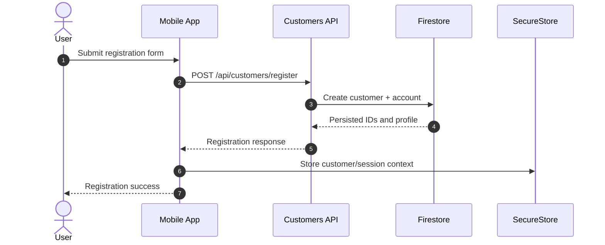

## 14.2 Username Login

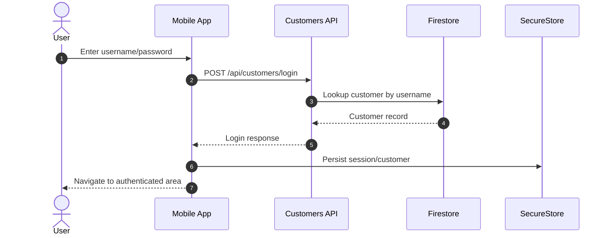

## 14.3 Device-Key Enrollment (Software or Hardware-Backed)

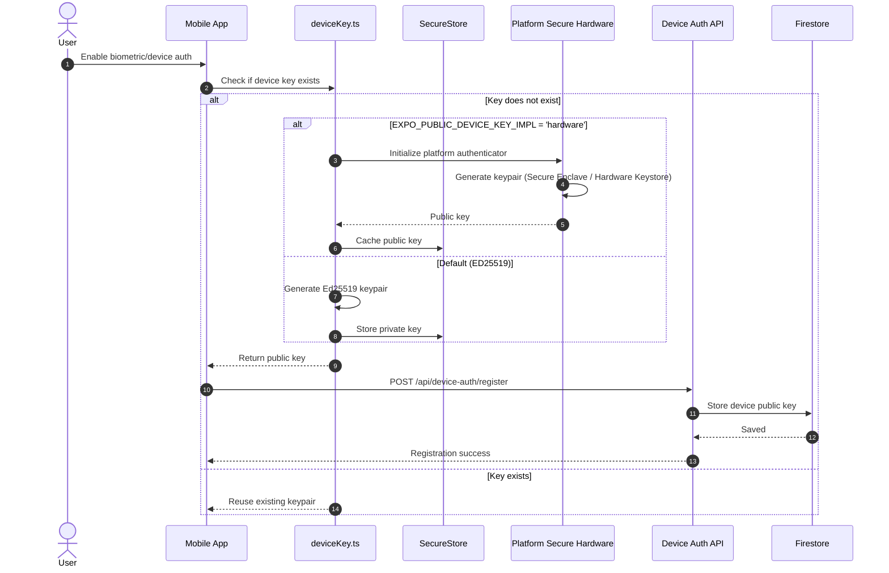

## 14.4 Device-Key Biometric Login (Software or Hardware-Backed)

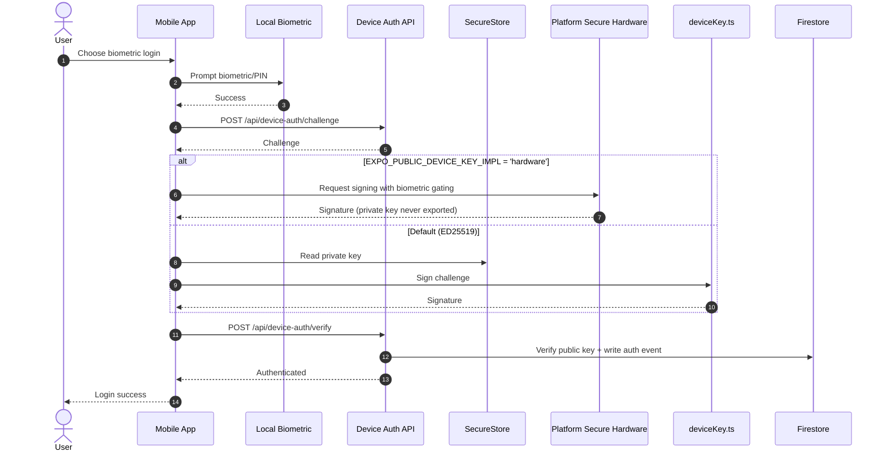

## 14.5 Passkey Registration (FIDO2)

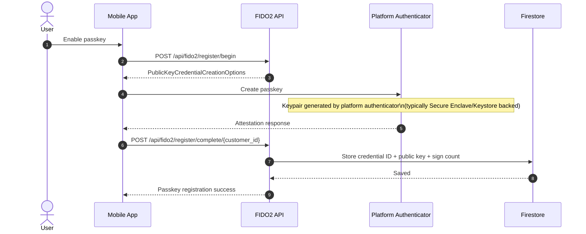

## 14.6 Passkey Login (FIDO2)

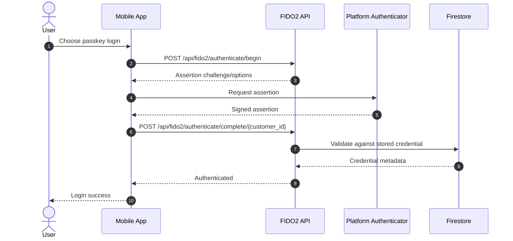

## 14.7 KYC Onboarding (Reference Face)

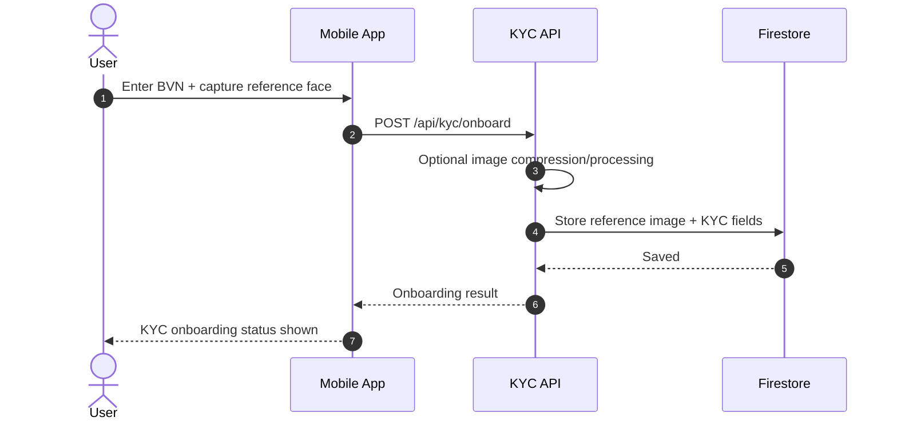

## 14.8 KYC Verification (Liveness + Face Match)

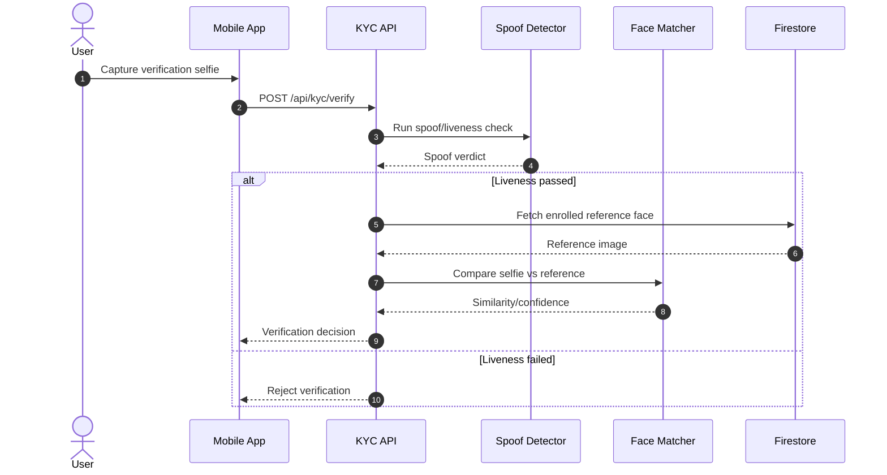

## 14.9 Limit Change

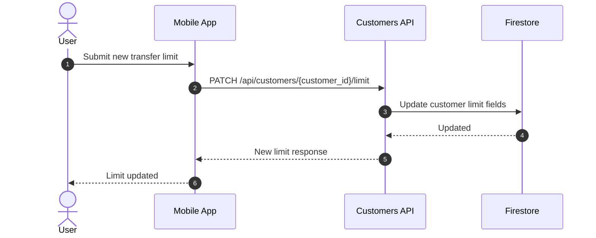

## 14.10 Transfer with Device-Key Authorization (Software or Hardware-Backed)

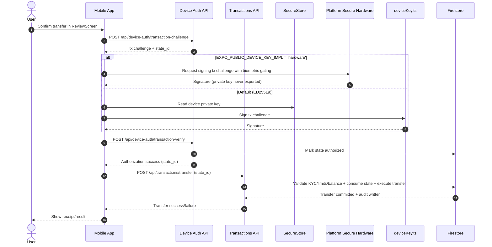

## 14.11 Transfer with Passkey Authorization (FIDO2)

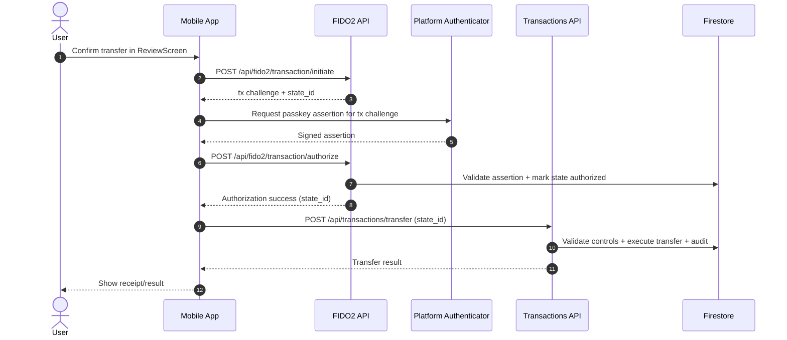

## 14.12 Push Authorization

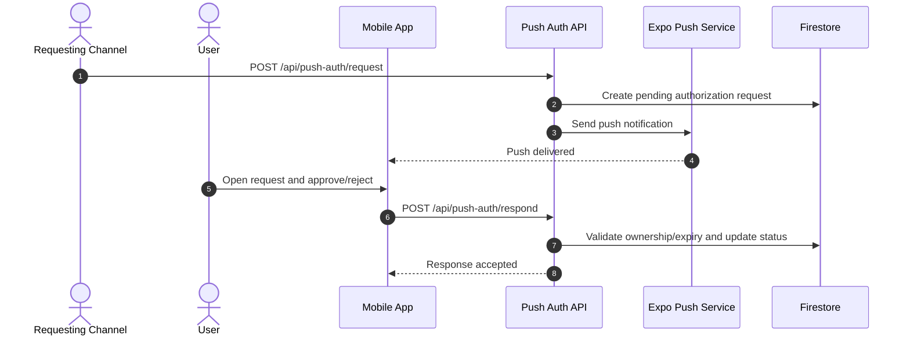

## 14.13 TOTP Setup and Verify

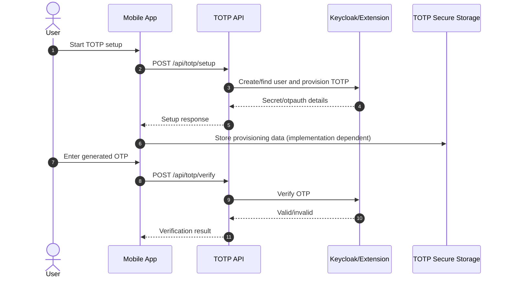
