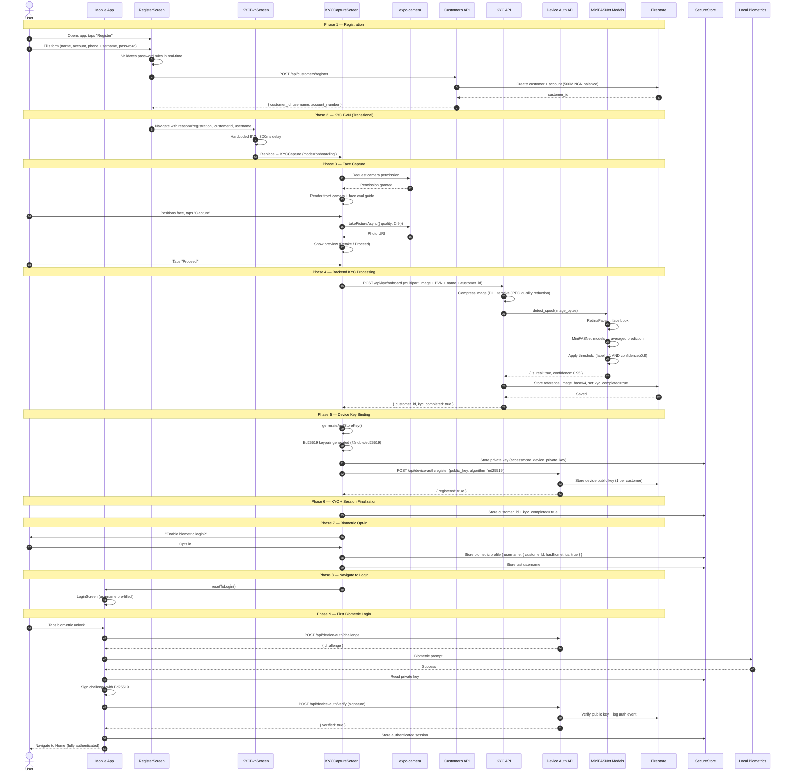

# Customer Onboarding with Device Binding and KYC Verification — User Flow

This document describes the complete end-to-end user flow for a new customer registering on the AccessMore mobile app, completing KYC face verification, binding their device cryptographically, and arriving at a fully authenticated session.

---

## Flow Summary

```
RegisterScreen → KYCBvnScreen → KYCCaptureScreen → (Device Key Generation + Biometric Opt-in) → LoginScreen → Authenticated Home
```

---

## Step 1 — User Opens the App and Navigates to Registration

1. The app launches and presents the `LoginScreen` (`mobile/src/screens/LoginScreen.tsx`).
2. The login screen displays the Access Bank logo, a username field, a password field, and action links at the bottom.
3. User taps the **"Register"** link at the bottom of the login screen.
4. The app pushes `RegisterScreen` (`mobile/src/screens/RegisterScreen.tsx`) onto the navigation stack within the `UnauthenticatedTabs > LoginTab` stack navigator.
5. A progress bar is shown at 31% to indicate the user is at the first stage of onboarding.

---

## Step 2 — User Fills in the Registration Form

1. `RegisterScreen` presents a `SafeAreaView` with a `KeyboardAvoidingView` containing six input fields:

   | Field | Keyboard Type | Auto-Capitalize | Required |
   |---|---|---|---|
   | First Name | default | words | Yes |
   | Last Name | default | words | Yes |
   | Account Number | number-pad | none | Yes |
   | Phone | phone-pad | none | Yes |
   | Username | default | none (lowercase) | Yes |
   | Password | default (secure entry) | none | Yes |
   | Confirm Password | default (secure entry) | none | Yes |

2. As the user types the password, the app performs **real-time password validation** against five rules, each displayed as a badge that turns green when satisfied:
   - At least 1 lowercase letter (`/[a-z]/`)
   - At least 1 uppercase letter (`/[A-Z]/`)
   - At least 1 digit (`/\d/`)
   - Minimum 8 characters
   - At least 1 special character (`/[!@#$%^&*()_+\-=[\]{};':"\\|,.<>/?]/`)

3. The **"Register"** button remains disabled until all fields are non-empty, passwords match, and all password rules are satisfied.

---

## Step 3 — App Submits Registration to the Backend

1. User taps the **"Register"** button.
2. The app calls the `registerCustomer()` API function (`mobile/src/api/customers.ts`) which sends:
   ```
   POST /api/customers/register
   Body: {
     account_number, phone, username, password, first_name, last_name
   }
   ```
3. **Backend handling** (`backend/app/routers/customers.py::register`):
   - Validates that `username`, `account_number`, `phone`, and `password` are all non-empty strings.
   - Checks username uniqueness by querying Firestore for an existing customer with the same username.
   - If validation passes, calls `firestore_client.create_customer()` to create a new customer document with the following fields:
     - `bvn`: empty string (populated later during KYC)
     - `name`: set to the provided username
     - `username`: provided username
     - `first_name`, `last_name`: provided values
     - `phone`: provided phone number
     - `password_hash`: SHA-256 hash of the password (unsalted — PoC constraint, see section 10 of system design)
     - `kyc_completed`: set to `True` (PoC shortcut — KYC onboarding will also set this)
     - `current_limit_ngn`: default 1,000,000 NGN
     - `created_at`, `updated_at`: current timestamps
   - Creates a default bank account via `firestore_client.add_account()`:
     - Account number: the provided `account_number`
     - Account type: `"savings"`
     - Initial balance: 500,000,000 NGN (PoC seed balance)
   - Returns response: `{ customer_id, username, account_number }`

4. If registration fails (e.g., duplicate username, missing fields), the backend returns an HTTP 400 error and the app displays an alert with the error message. The user remains on `RegisterScreen`.

---

## Step 4 — App Routes User to KYC BVN Screen

1. On receiving a successful registration response, `RegisterScreen` navigates to `KYCBvnScreen` (`mobile/src/screens/KYCBvnScreen.tsx`) using `navigation.navigate()`:
   ```typescript
   navigation.navigate('KYCBvn', {
     reason: 'registration',
     customerId: data.customer_id,
     username: data.username,
   })
   ```
2. Route parameters passed:
   - `reason`: `'registration'` — tells downstream screens this is a new-user onboarding flow
   - `customerId`: the newly created customer ID from the backend
   - `username`: the registered username

---

## Step 5 — KYC BVN Screen (Transitional)

1. `KYCBvnScreen` receives route parameters (`reason`, `customerId`, `username`).
2. In the current PoC implementation, this screen does **not** collect BVN from the user. Instead, it uses a hardcoded BVN value (`'12345678901'`).
3. After a brief 300ms delay (to allow the UI to render), the screen auto-navigates to `KYCCaptureScreen` using `navigation.replace()`:
   ```typescript
   navigation.replace('KYCCapture', {
     mode: 'onboarding',
     reason: 'registration',
     bvn: '12345678901',
     name: user?.name ?? username ?? 'Customer',
     customerId,
     registrationUsername: username,
   })
   ```
4. Route parameters forwarded to KYCCapture:
   - `mode`: `'onboarding'` — indicates this is the reference image capture (not a verification selfie)
   - `reason`: `'registration'`
   - `bvn`: the hardcoded BVN string
   - `name`: display name for the customer
   - `customerId`: the backend customer ID
   - `registrationUsername`: the username used during registration (used later for biometric profile setup)

---

## Step 6 — KYC Capture Screen — Camera Permission and Face Capture UI

1. `KYCCaptureScreen` (`mobile/src/screens/KYCCaptureScreen.tsx`) initializes with the screen state set to `'camera'`.
2. The screen imports `CameraView` and `useCameraPermissions` from `expo-camera`.
3. On mount, the screen checks camera permission status:
   - If permission is not yet granted, calls `requestPermission()` to trigger the iOS/Android system permission dialog.
   - If the user denies permission, an error state is shown and the user cannot proceed.
4. Once permission is granted, the screen renders:
   - A **front-facing camera** (`CameraView` with `facing='front'`) filling the screen area.
   - A **face guide overlay** drawn on top of the camera preview:
     - A semi-transparent dark overlay covers the entire camera view.
     - A transparent oval cutout is masked in the center where the user should position their face.
     - Oval dimensions: width = `Math.min(260, SCREEN_WIDTH * 0.65)`, height = `width * 1.35`.
     - Four corner markers are drawn at the oval boundary for visual alignment guidance.
   - Instructional text prompting the user to align their face within the oval.
   - A **"Capture"** button at the bottom of the screen.

---

## Step 7 — User Captures Their Face Image

1. User positions their face within the oval guide and taps the **"Capture"** button.
2. The app calls `cameraRef.current.takePictureAsync()` with configuration:
   ```typescript
   { quality: 0.9, base64: false }
   ```
   - Quality is set to 0.9 (high quality JPEG).
   - `base64: false` means the image is saved as a file URI, not an in-memory base64 string.
3. The camera returns a photo object containing a `uri` pointing to the captured image file on the device filesystem.
4. The screen transitions to `'preview'` state, displaying the captured image for the user to review.
5. The user sees two options:
   - **"Retake"** — returns to `'camera'` state to capture a new image.
   - **"Proceed"** / **"Continue"** — submits the image for KYC processing.

---

## Step 8 — App Submits Image to Backend for KYC Onboarding

1. User taps **"Proceed"**. The screen transitions to `'processing'` state and displays a loading spinner.
2. Since `mode` is `'onboarding'`, the app calls the `kycOnboard()` API function (`mobile/src/api/kyc.ts`):
   ```typescript
   const data = await kycOnboard({
     bvn: params.bvn.trim(),
     name: params.name ?? user?.name ?? 'Customer',
     referenceImageUri: capturedUri,
     customerId: params.customerId ?? customerId,
   })
   ```
3. The API function constructs a **multipart/form-data** request:
   ```
   POST /api/kyc/onboard
   Content-Type: multipart/form-data

   Fields:
     - bvn: "12345678901"
     - name: "username"
     - customer_id: "abc123..."
   Files:
     - reference_image: (the captured JPEG file from the device)
   ```
4. The request has a **6-minute timeout** configured because the ML spoof detection models may need to load into memory on the first invocation.

---

## Step 9 — Backend Processes KYC Onboarding Request

The backend KYC onboarding endpoint (`backend/app/routers/kyc.py`) processes the request through the following stages:

### 9a — Image Compression

1. Backend receives the uploaded image file and reads it into bytes.
2. Uses PIL (Pillow) to compress the image iteratively:
   - Starts at JPEG quality 85, reduces down to quality 40 in steps.
   - Resizes image dimensions if the file size exceeds limits.
   - Ensures the base64-encoded result fits within Firestore's 1 MiB document field limit.
3. The compressed image is base64-encoded for storage.

### 9b — Anti-Spoof / Liveness Detection (MiniFASNet AI Models)

1. Backend calls `get_spoof_detection_service().detect_spoof(image_bytes)`.
2. **If Silent-Face-Anti-Spoofing models are available** (production path):
   - The `SpoofDetectionService` (`backend/app/services/spoof_detection.py`) loads the MiniFASNet models from the `Silent-Face-Anti-Spoofing` directory:
     - Detection model: **RetinaFace** (located in `resources/detection_model/`) for face bounding-box extraction.
     - Anti-spoof models: all `.pth` files in `resources/anti_spoof_models/` (MiniFASNet variants at different scales).
   - **Detection pipeline**:
     1. Convert raw image bytes to an OpenCV BGR image array.
     2. Run `AntiSpoofPredict.get_bbox(image)` using the RetinaFace detector to locate the face bounding box in the image.
     3. If no face is detected, the check fails immediately.
     4. For each `.pth` anti-spoof model:
        - Parse the model filename to extract input dimensions (`h_input`, `w_input`) and crop `scale`.
        - Crop the face region from the original image using `CropImage.crop(org_img, bbox, scale, out_w, out_h)`.
        - Run inference: `AntiSpoofPredict.predict(cropped_img, model_path)` → returns a 3-class logit array `[fake_score, real_score, other_score]`.
     5. Average the prediction arrays across all models.
     6. Determine the label: `argmax(averaged_prediction)` — label 1 = real, labels 0 or 2 = spoof.
     7. Compute confidence: the maximum probability from the averaged predictions.
     8. Apply threshold: `is_real = (label == 1) AND (confidence >= 0.8)`.
   - Returns:
     ```json
     {
       "is_real": true/false,
       "confidence": 0.0–1.0,
       "reason": "Image classified as real/spoof...",
       "details": {
         "label": 0/1/2,
         "prediction": [p0, p1, p2],
         "method": "silent_face_anti_spoofing"
       }
     }
     ```

3. **If Silent-Face models are NOT available** (fallback heuristic path):
   - Uses basic image analysis: Laplacian variance (sharpness), color channel variance, and Canny edge density.
   - Assigns a heuristic score starting at 0.7, penalizing for suspicious characteristics (very blurry, very sharp, low color variance).
   - This path is NOT production-grade and is only a development fallback.

4. **If `is_real` is `false`**: the backend returns HTTP 400 with message `"Reference image failed liveness check"`. The mobile app receives the error, transitions to `'error'` state, and displays a retry option.

### 9c — Database Persistence

1. If the liveness check passes, the backend stores the reference data in Firestore:
   - Calls `firestore_client.update_customer_kyc_reference(customer_id, base64_image)` which:
     - Sets `reference_image_base64` field on the customer document to the compressed base64 image.
     - Sets `kyc_completed` to `True`.
     - Updates `updated_at` timestamp.
   - If the customer does not yet have a bank account, creates a default one:
     - Account number: `"9" + SHA256(customer_id)[:9]` (generated deterministically)
     - Type: `"savings"`
     - Initial balance: 500,000,000 NGN
2. Returns response:
   ```json
   {
     "customer_id": "abc123...",
     "kyc_completed": true
   }
   ```

---

## Step 10 — Mobile App Receives KYC Onboarding Success

1. The app receives the successful KYC onboarding response containing `customer_id` and `kyc_completed: true`.
2. The app calls `completeKYCWithCustomerId(data.customer_id)` from `AuthContext`:
   - Stores the `customer_id` in SecureStore under key `accessmore_customer_id`.
   - Stores `'true'` in SecureStore under key `accessmore_kyc_completed`.
   - Updates React state: `setCustomerId(customerId)`, `setKycCompletedState(true)`.
3. The screen transitions to `'success'` state.

---

## Step 11 — Device Key Generation and Binding

Immediately after KYC success and before showing the success UI, the app performs cryptographic device binding:

### 11a — Ed25519 Key Pair Generation (Software Mode — Default)

1. The app calls `generateAndStoreKey()` from `mobile/src/lib/deviceKey.ts`.
2. **Key generation process**:
   - Uses `@noble/ed25519` library with `react-native-get-random-values` polyfill for secure random number generation.
   - Generates a 32-byte random private key: `ed.utils.randomPrivateKey()`.
   - Derives the corresponding 32-byte Ed25519 public key: `await ed.getPublicKeyAsync(secretKey)`.
   - Base64-encodes both keys (43 characters each).
   - Stores the **private key** in `expo-secure-store` under key `accessmore_device_private_key`.
     - On iOS: encrypted by the Keychain with device passcode protection.
     - On Android: encrypted by the Android Keystore system.
   - Returns `{ publicKeyB64: "<43-char base64 string>" }`.

> **Note**: If `EXPO_PUBLIC_DEVICE_KEY_IMPL` is set to `'hardware'`, the app instead calls `generateAndStoreHardwareKey()` which uses `react-native-biometrics` to generate the keypair in the platform's Secure Enclave (iOS) or Hardware Keystore (Android). The private key never leaves secure hardware in this mode. This requires a native Expo development build (not Expo Go).

### 11b — Register Device Public Key with Backend

1. The app calls `registerDeviceKey(data.customer_id, publicKeyB64)` from `mobile/src/api/deviceAuth.ts`:
   ```
   POST /api/device-auth/register
   Body: {
     customer_id: "abc123...",
     public_key: "<base64-encoded 32-byte Ed25519 public key>",
     algorithm: "ed25519"
   }
   ```
2. **Backend handling** (`backend/app/routers/device_auth.py::register`):
   - Decodes the base64 public key and validates it is exactly 32 bytes (valid Ed25519 public key length).
   - Stores the public key in Firestore via `firestore_client.set_device_public_key(customer_id, public_key_b64, algorithm)`.
   - Only **one device key per customer** is stored — registering a new key replaces any previous key (device change scenario).
   - Returns: `{ registered: true, customer_id: "abc123..." }`.
3. The device is now cryptographically bound to this customer's account. Future biometric logins and transaction authorizations will use this key pair for challenge-response authentication.

---

## Step 12 — Biometric Login Opt-In

1. Since the `reason` parameter is `'registration'`, the success screen presents the user with an option to **enable biometric login** for future sessions.
2. If the user opts in:
   - The app calls `setBiometricsForUsername(username, data.customer_id)` which persists a biometric profile in `expo-secure-store` under key `accessmore_biometric_profiles`:
     ```json
     {
       "<username>": {
         "customerId": "abc123...",
         "hasBiometrics": true
       }
     }
     ```
   - This profile is checked on the `LoginScreen` to determine whether to show the biometric login option.
3. If the user declines, biometric login is not configured, and the user will authenticate with username/password on future logins.

---

## Step 13 — Navigation to Login Screen

1. After the success state and optional biometric opt-in, the screen presents a **"Continue"** or **"Go to Login"** button.
2. The app stores the username via `SecureStore.setItemAsync(LAST_USERNAME_KEY, username)` so the login screen can pre-fill it.
3. The app resets the navigation stack to the `LoginScreen` using `resetToLogin()`:
   - This replaces the entire navigation history so the user cannot navigate back to the registration/KYC screens.
4. The user arrives at `LoginScreen` with their username pre-filled.

---

## Step 14 — First Login After Registration

The user can now authenticate using one of two methods:

### Option A — Biometric Login (if opted in during Step 12)

1. `LoginScreen` detects a stored biometric profile for the pre-filled username via `getProfile(username)`.
2. The screen displays a welcome message and a biometric unlock prompt instead of the password field.
3. User taps **"Unlock with Biometrics"** or the biometric icon.
4. The app calls `loginWithBiometrics(storedUsername)` from `AuthContext`:
   - Retrieves the biometric profile from SecureStore to get the `customerId`.
   - Requests a cryptographic challenge from the backend:
     ```
     POST /api/device-auth/challenge
     Body: { customer_id: "abc123..." }
     ```
   - Backend generates 32 random bytes, base64url-encodes them, and stores them in an in-memory challenge map keyed by `customer_id`. Returns `{ challenge: "<base64url string>" }`.
   - The app calls `signChallengeAfterBiometrics(challenge)` from `deviceKey.ts`:
     1. Reads the Ed25519 private key from SecureStore.
     2. Triggers the platform biometric prompt via `expo-local-authentication`:
        ```typescript
        LocalAuthentication.authenticateAsync({
          promptMessage: 'Authenticate to continue',
          fallbackLabel: 'Use PIN'
        })
        ```
     3. If biometric authentication succeeds, signs the challenge bytes using `@noble/ed25519`:
        ```typescript
        const signature = await ed.signAsync(message, secretKey)
        ```
     4. Returns the 64-byte signature as a base64 string (86 characters).
   - The app sends the signature to the backend for verification:
     ```
     POST /api/device-auth/verify
     Body: {
       customer_id: "abc123...",
       challenge: "<original challenge>",
       signature: "<base64 signature>",
       device_name: "<device identifier>"
     }
     ```
   - Backend pops the stored challenge (one-time use), loads the stored Ed25519 public key, and verifies the signature using the `cryptography` library. If valid, logs an auth event and returns `{ verified: true, customer_id }`.
5. On successful verification, `AuthContext` stores the authenticated session:
   - `USER_KEY`: `{ userId: customerId, name: username }`
   - `DEVICE_ID_KEY`: device fingerprint from `Constants.installationId`
   - `CUSTOMER_ID_KEY`: the customer ID
   - `KYC_KEY`: `'true'`
   - `LAST_USERNAME_KEY`: the username
   - Registers push notification token if available.
6. The app transitions to the `AuthenticatedTabs` navigator, landing on the **Home** screen.

### Option B — Username + Password Login

1. User enters their password in the password field and taps **"Login"**.
2. The app calls `login(username, password)` from `AuthContext`:
   - Calls `ensureCustomerByUsername(username)` API (`POST /api/customers/ensure-by-username`).
   - Backend looks up the customer by username and returns `{ customer_id, created: false }`.
   - **Note**: Password verification is not enforced server-side in the current PoC (see system design section 10).
3. `AuthContext` stores the session identically to the biometric path (Step 14a.5) except `KYC_KEY` is loaded from existing SecureStore state rather than explicitly set to `'true'`.
4. The app navigates to the authenticated Home screen.

---

## Complete End-to-End Sequence Diagram



---

## Key Data Artifacts Created During Onboarding

| Artifact | Storage Location | Created At Step | Purpose |
|---|---|---|---|
| Customer record | Firestore `customers` collection | Step 3 | Identity, profile, KYC status |
| Bank account | Firestore `customers/{id}/accounts` | Step 3 | Financial account with seed balance |
| Password hash (SHA-256) | Firestore customer doc `password_hash` | Step 3 | Login credential (PoC — not production-grade) |
| Reference face image | Firestore customer doc `reference_image_base64` | Step 9c | KYC face comparison baseline |
| Ed25519 private key | Device SecureStore `accessmore_device_private_key` | Step 11a | Challenge-response signing for biometric login and transactions |
| Ed25519 public key | Firestore `device_public_keys` collection | Step 11b | Server-side signature verification |
| Biometric profile | Device SecureStore `accessmore_biometric_profiles` | Step 12 | Maps username → customerId + biometric enrollment flag |
| Last username | Device SecureStore `accessmore_last_username` | Step 13 | Pre-fills login screen on next app launch |
| Session context | Device SecureStore (multiple keys) | Step 14 | Authenticated session state (userId, customerId, kycCompleted) |
| Device auth event | Firestore `device_auth_events` | Step 14a | Audit log entry for the biometric login |

---

## Error Scenarios and Recovery Paths

| Error | Step | User Experience | Recovery |
|---|---|---|---|
| Duplicate username | Step 3 | Alert: "Username already taken" | User changes username and retries |
| Missing required fields | Step 3 | Alert: backend validation error | User fills in missing fields |
| Camera permission denied | Step 6 | Error state shown, cannot proceed | User grants permission in device Settings, retries |
| Spoof / liveness check failed | Step 9b | Screen transitions to `'error'` state with message | User taps "Retry" → returns to camera to recapture |
| No face detected in image | Step 9b | Backend returns error | User recaptures with face properly positioned in oval |
| Network timeout (6 min) | Step 8 | Network error alert | User taps "Retry" — ML models are likely loaded by now, so retry is faster |
| Device key generation failure | Step 11a | Error logged, may not block flow | Soft failure — user can proceed but biometric login will not work (known gap) |
| Device key registration failure | Step 11b | Error logged | Device key not bound; biometric login unavailable until re-enrollment |
| Biometric hardware unavailable | Step 14a | Biometric prompt not shown | User falls back to username + password login |
| Challenge-response verification failure | Step 14a | Login error alert | User retries or falls back to password login |

---

## Security Considerations

1. **Liveness detection** is the primary gate against presentation attacks (printed photos, screen replays). The MiniFASNet ensemble with a 0.8 confidence threshold provides the anti-spoof barrier during onboarding.
2. **Device binding** via Ed25519 challenge-response ensures that only the physical device holding the private key can perform biometric logins and authorize transactions.
3. **Private key isolation**: In software mode, the private key is stored in `expo-secure-store` (encrypted at rest by the OS keychain/keystore). In hardware mode, the private key never leaves the Secure Enclave / Hardware Keystore.
4. **One-time challenges**: Each challenge issued by `/api/device-auth/challenge` is popped from the server-side store after use, preventing replay attacks.
5. **Single device key per customer**: Registering a new device key replaces the old one, ensuring only one device is bound at any time.
6. **Known PoC limitations**: Password hashing uses unsalted SHA-256, server-side password verification is not enforced, and challenge stores are in-memory (not persistent across server restarts). See system design section 10 for the full list.
