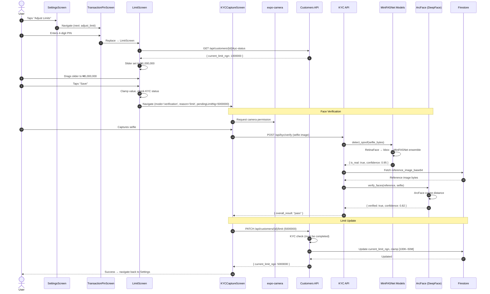
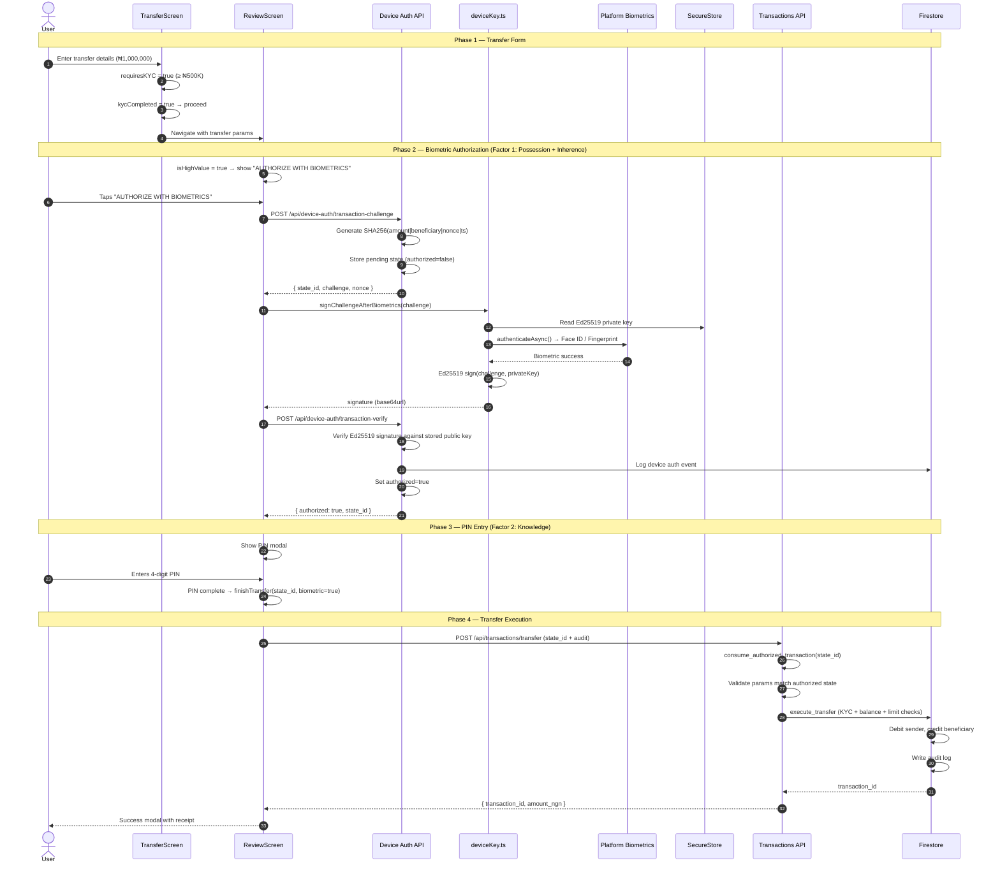
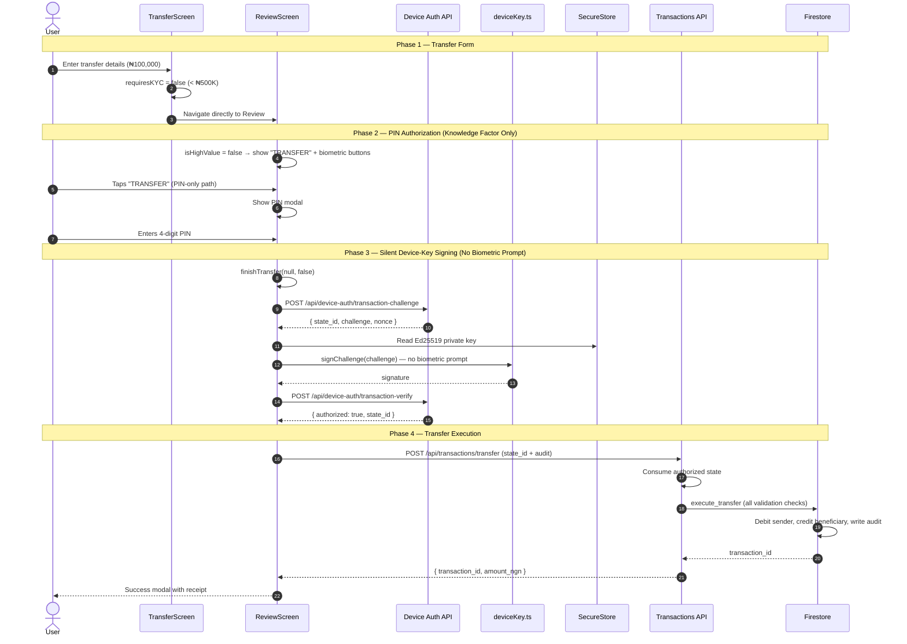

# Transaction Limit Change, High-Value MFA Transfer, and Low-Value Transfer Authorization — User Flows

This document describes three complete end-to-end user flows for authenticated customers on the AccessMore mobile app:

1. **Transaction Limit Change with KYC Verification** — Adjusting the daily transfer limit, gated by face liveness verification.
2. **High-Value Transfer with Multi-Factor Authorization (MFA)** — Transfers of ₦500,000 or above requiring biometric device-key signing + PIN.
3. **Low-Value Transfer Authorization** — Transfers below ₦500,000 with PIN-only or optional biometric authorization.

All flows assume the user is already authenticated and on the `AuthenticatedTabs` navigator (Home screen).

---

## Flow 1 — Transaction Limit Change with KYC Verification

### Flow Summary

```
Home → Settings → TransactionPinScreen (PIN gate) → LimitScreen (slider) → KYCCaptureScreen (face verify) → Backend verify → Limit updated → Settings
```

---

### Step 1 — User Navigates to Settings

1. The user taps the **Settings** tab on the bottom tab navigator within `AuthenticatedTabs`.
2. The app renders `SettingsScreen` (`mobile/src/screens/SettingsScreen.tsx`).
3. On screen focus, `SettingsScreen` runs a refresh callback via `useFocusEffect` that:
   - Loads the biometric profile from SecureStore to check if biometrics are enabled.
   - Checks for an existing TOTP token in SecureStore under key `accessmore_totp_accounts`.
4. The settings screen presents several options including **"Adjust Limits"**.

---

### Step 2 — User Taps "Adjust Limits"

1. User taps the **"Adjust Limits"** menu item.
2. `SettingsScreen` calls:
   ```typescript
   navigation.navigate('TransactionPin', { next: { type: 'adjust_limit' } })
   ```
3. The app pushes `TransactionPinScreen` (`mobile/src/screens/TransactionPinScreen.tsx`) onto the `SettingsTab` stack as a modal overlay.

---

### Step 3 — Transaction PIN Gateway

1. `TransactionPinScreen` renders a PIN entry bottom sheet with:
   - 4 circular PIN dots that fill as digits are entered.
   - A 12-key numeric pad: digits 0–9, a biometric icon key (`'bio'`), and a backspace key (`'del'`).
   - The screen background is dark (`#1a1a1a`).
2. The user enters their **4-digit transaction PIN**.
3. As each digit is entered, the corresponding dot fills. When the 4th digit is entered, `handlePinComplete()` fires automatically.
4. Since `next.type` is `'adjust_limit'`, the handler executes:
   ```typescript
   navigation.replace('Limit')
   ```
5. The `TransactionPinScreen` is replaced by `LimitScreen` (`mobile/src/screens/LimitScreen.tsx`) on the settings stack.

> **Note**: The PIN is validated locally as a UX gate only. Server-side PIN verification is not enforced in the current PoC (see system design section 10). The PIN step prevents accidental limit changes and adds a lightweight friction layer.

---

### Step 4 — Limit Screen — Loading Current Limit

1. `LimitScreen` initializes with state:
   - `sliderValue`: initially set to `MIN_LIMIT_NGN` (₦100,000).
   - `loading`: `true`.
2. On mount, the screen loads the customer's current limit by calling `getKycStatus()` from `mobile/src/api/kyc.ts`:
   ```
   GET /api/customers/{customer_id}/kyc-status
   ```
3. **Backend handling** (`backend/app/routers/customers.py`):
   - Fetches the customer document from Firestore.
   - Returns:
     ```json
     {
       "customer_id": "abc123...",
       "kyc_completed": true,
       "has_reference_image": true,
       "current_limit_ngn": 1000000
     }
     ```
4. The screen sets `sliderValue` to the returned `current_limit_ngn` value (e.g., ₦1,000,000).
5. If `kycCompleted` is `false` or `customerId` is null, the screen displays a message instructing the user to complete KYC first and disables the save action.

---

### Step 5 — User Adjusts the Transfer Limit

1. `LimitScreen` renders:
   - A heading showing the current limit.
   - A **horizontal slider** component with:
     - Minimum value: `₦100,000` (`MIN_LIMIT_NGN`)
     - Maximum value: `₦50,000,000` (`MAX_LIMIT_NGN`)
     - Step increment: `₦100,000`
   - A formatted label below the slider showing the selected value (e.g., "₦5,000,000").
   - A **"Save"** button.
2. The user drags the slider to their desired new limit value.
3. User taps the **"Save"** button.

---

### Step 6 — KYC Face Verification Required

1. `handleSave()` fires and performs pre-checks:
   - Clamps the value: `Math.round(Math.max(MIN_LIMIT_NGN, Math.min(MAX_LIMIT_NGN, sliderValue)))`.
   - Checks `kycCompleted`:
     - If `false`: navigates to `KYCBvn` with `reason: 'limit'` to start the full KYC onboarding first.
     - If `true`: proceeds to face verification.
   - Checks `customerId`:
     - If `null`: shows an alert "Complete KYC first" and returns.

2. Since KYC is already completed for this flow, the app navigates directly to `KYCCaptureScreen`:
   ```typescript
   navigation.navigate('KYCCapture', {
     mode: 'verification',
     reason: 'limit',
     pendingLimitNg: clamped,   // The new desired limit value
   })
   ```
3. The screen is replaced by `KYCCaptureScreen` in verification mode.

---

### Step 7 — Face Capture for Verification

1. `KYCCaptureScreen` (`mobile/src/screens/KYCCaptureScreen.tsx`) initializes in `'camera'` state.
2. The screen requests camera permission via `useCameraPermissions()` from `expo-camera`.
3. Once permission is granted, the screen renders:
   - A **front-facing camera** (`CameraView` with `facing='front'`).
   - A **face guide overlay**: a semi-transparent dark layer with a transparent oval cutout centered on the screen.
     - Oval dimensions: width = `Math.min(260, SCREEN_WIDTH * 0.65)`, height = `width * 1.35`.
     - Four corner markers at the oval boundary for alignment.
   - Instructional text: "Position your face within the frame".
   - A **"Capture"** button at the bottom.
4. The user positions their face within the oval and taps **"Capture"**.
5. The app calls `cameraRef.current.takePictureAsync({ quality: 0.9, base64: false })`.
6. The screen transitions to `'preview'` state showing the captured image.
7. The user reviews and taps **"Proceed"** (or **"Retake"** to recapture).

---

### Step 8 — App Submits Selfie for KYC Verification

1. The screen transitions to `'processing'` state with a loading spinner.
2. Since `mode` is `'verification'`, the app calls `kycVerify()` from `mobile/src/api/kyc.ts`:
   ```
   POST /api/kyc/verify
   Content-Type: multipart/form-data

   Fields:
     - customer_id: "abc123..."
   Files:
     - selfie_image: (the captured JPEG file)
   ```
3. The request has a **6-minute timeout** (ML model cold-start on first call).

---

### Step 9 — Backend Processes KYC Verification

The backend KYC verify endpoint (`backend/app/routers/kyc.py`) processes in two stages:

#### 9a — Anti-Spoof / Liveness Detection

1. Backend calls `get_spoof_detection_service().detect_spoof(selfie_bytes)`.
2. **MiniFASNet detection pipeline** (when Silent-Face models are available):
   - Converts raw image bytes to an OpenCV BGR array.
   - Runs **RetinaFace** detector (`AntiSpoofPredict.get_bbox(image)`) to locate the face bounding box.
   - If no face is detected, returns failure immediately.
   - For each `.pth` anti-spoof model in `resources/anti_spoof_models/`:
     - Parses model filename for input dimensions (`h_input`, `w_input`) and crop `scale`.
     - Crops the face region: `CropImage.crop(org_img, bbox, scale, out_w, out_h)`.
     - Runs inference: `AntiSpoofPredict.predict(cropped_img, model_path)` → 3-class logit array `[fake, real, other]`.
   - Averages predictions across all models.
   - Determines label: `argmax(averaged)` — label `1` = real, labels `0` or `2` = spoof.
   - Computes confidence: maximum probability from the averaged predictions.
   - Applies threshold: `is_real = (label == 1) AND (confidence >= 0.8)`.
3. If `is_real` is `false`:
   - Returns immediately without face matching:
     ```json
     {
       "liveness_check": { "is_real": false, "confidence": 0.65 },
       "face_verification": null,
       "overall_result": "spoof_detected",
       "message": "Liveness check failed – possible spoof detected"
     }
     ```
   - The mobile app transitions to `'error'` state and displays a retry option.

#### 9b — Face Matching Against Reference

1. If liveness passes, the backend fetches the stored reference image:
   ```python
   reference_bytes = db.get_customer_reference_image(customer_id)
   ```
   - Decodes the `reference_image_base64` field from the customer document back to raw bytes.

2. Calls `get_face_verification_service().verify_faces(reference_bytes, selfie_bytes)`:
   - Uses **ArcFace** model via the **DeepFace** library.
   - Writes both images to temporary JPEG files (DeepFace requires file paths).
   - Calls:
     ```python
     DeepFace.verify(
       img1_path=reference_temp,
       img2_path=selfie_temp,
       model_name="ArcFace",
       detector_backend="retinaface",
       enforce_detection=True,
       distance_metric="cosine"
     )
     ```
   - Extracts: `verified` (bool), `distance` (float, cosine — lower is better), `threshold` (0.68 for ArcFace).
   - Calculates confidence:
     - If `distance < threshold`: `confidence = 1.0 - (distance / threshold) * 0.5` (maps to 0.5–1.0 range).
     - If `distance >= threshold`: `confidence = 0.0`.
   - Returns: `{ verified: bool, confidence: float, distance: float }`.

3. Response to mobile:
   ```json
   {
     "liveness_check": { "is_real": true, "confidence": 0.95 },
     "face_verification": { "verified": true, "confidence": 0.82, "distance": 0.45 },
     "overall_result": "pass",
     "message": "Verification successful"
   }
   ```

---

### Step 10 — Verification Success — Limit Update Executed

1. The app receives `overall_result: "pass"` from the backend.
2. Since `reason` is `'limit'`, `KYCCaptureScreen` proceeds to update the limit:
   - Calls `updateLimit()` from `mobile/src/api/kyc.ts`:
     ```
     PATCH /api/customers/{customer_id}/limit
     Body: { "limit_ngn": 5000000 }
     ```
3. **Backend handling** (`backend/app/routers/customers.py::update_limit`):
   - Fetches the customer document from Firestore.
   - If customer not found → `404 "Customer not found"`.
   - **KYC check**: `if not cust.get("kyc_completed")` → `403 "KYC must be completed before increasing limit"`.
   - Calls `firestore_client.update_customer_limit(customer_id, limit_ngn)`:
     - Clamps the value to `[₦100,000 — ₦50,000,000]`.
     - Updates the `current_limit_ngn` field on the customer document.
     - Updates `updated_at` timestamp.
   - Returns:
     ```json
     {
       "customer_id": "abc123...",
       "current_limit_ngn": 5000000
     }
     ```
4. The `KYCCaptureScreen` transitions to `'success'` state.

---

### Step 11 — Navigation Back to Settings

1. The success screen shows a confirmation that the limit has been updated.
2. The screen calls `resetToSettings()` which resets the navigation stack to `SettingsScreen` with a `limitIncreased: true` parameter.
3. The user arrives back at `SettingsScreen`. The new limit is reflected the next time they initiate a transfer.

---

### Limit Change Sequence Diagram



---

## Flow 2 — High-Value Transfer with Multi-Factor Authorization (MFA)

A high-value transfer is any transfer where the amount is **≥ ₦500,000** (`KYC_AMOUNT_THRESHOLD_NGN`). This flow requires:
- **KYC verification completed** (reference image on file)
- **Biometric device-key signature** (cryptographic proof of device possession + biometric presence)
- **Transaction PIN** (knowledge factor)

### Flow Summary

```
Home → TransferScreen (form + KYC check) → ReviewScreen (biometric signing + PIN) → Backend transfer execution → Success
```

---

### Step 1 — User Initiates a Transfer from Home

1. The user is on `HomeScreen` within the `AuthenticatedTabs > HomeTab` stack.
2. User taps the **"Transfer"** action (button or menu item).
3. The app pushes `TransferScreen` (`mobile/src/screens/TransferScreen.tsx`) onto the `HomeTab` stack.

---

### Step 2 — Transfer Form — Entry and Validation

1. `TransferScreen` loads with step set to `'form'`.
2. The screen fetches the user's account details:
   - Uses `customerId` from `AuthContext`.
   - Loads accounts (including `senderAccountNumber`, `senderAccountType`, balance) from the stored or fetched data.
   - Fetches the transfer limit: either from local state or via the KYC status endpoint.
3. The screen renders:
   - **Account card** at the top showing the sender's account number, type, and current balance (with loading state while fetching).
   - **Limit bar visualization** showing the daily transfer limit.
   - **Form fields**:

     | Field | Input Type | Validation |
     |---|---|---|
     | Bank | Dropdown modal with bank list | Must be selected |
     | Account Number | Numeric, 10 digits | Exactly 10 digits required |
     | Amount | Numeric with ₦ prefix | Must be > 0 and ≤ transfer limit |
     | Narration | Free text | Optional |

4. **Beneficiary lookup** runs automatically:
   - When the user enters a valid 10-digit account number and selects a bank, the app calls `useAccountLookupQuery(accountNumber, !!selectedBank)`.
   - This calls:
     ```
     GET /api/customers/lookup-account/{account_number}
     ```
   - Backend searches all customer accounts for a matching `account_number` and returns `{ account_number, customer_name, account_type }`.
   - The resolved **beneficiary name** is displayed below the account number field (e.g., "John Doe").
   - A loading indicator shows while the lookup is in progress.

5. **Amount validation**:
   - `amountNum` is parsed from the formatted string.
   - `effectiveLimit` is the fetched `transferLimit` or fallback `MAX_TRANSFER_AMOUNT_NGN` (₦10,000,000).
   - If `amountNum > effectiveLimit`: displays error "Amount is above transaction limit."
   - The **"Proceed"** button is disabled until:
     ```typescript
     canProceed = !!customerId && !!selectedBank &&
       accountNumber.trim().length === 10 &&
       amountNum > 0 && amountNum <= effectiveLimit
     ```

---

### Step 3 — KYC Requirement Check

1. The user enters an amount of **₦500,000 or more** (e.g., ₦1,000,000).
2. The app evaluates:
   ```typescript
   const requiresKYC = amountNum >= KYC_AMOUNT_THRESHOLD_NGN  // ≥ 500,000
   ```
3. User taps **"Proceed"**.
4. `handleProceed()` checks:
   ```typescript
   if (requiresKYC && !kycCompleted) {
     setStep('kyc_prompt')  // Show KYC requirement prompt
     return
   }
   ```
5. **If KYC is NOT completed** (`kycCompleted === false`):
   - The screen switches to `step: 'kyc_prompt'` — an overlay or section that informs the user that KYC verification is required for transfers of ₦500,000+.
   - A button routes the user to `KYCBvnScreen` with `reason: 'transfer'` and the pending transfer details.
   - After completing KYC, the user is returned to the transfer flow (see KYC onboarding user flow document).

6. **If KYC IS completed** (normal high-value path):
   - The app navigates to `ReviewScreen`:
     ```typescript
     navigation.navigate('Review', {
       senderAccountNumber,
       senderAccountType,
       amount: amountNum,              // e.g., 1000000
       beneficiaryAccountNumber: accountNumber.trim(),
       beneficiaryName,
       bankName: selectedBank.name,
       narration,
       customerId,
     })
     ```

---

### Step 4 — Review Screen — Transfer Summary

1. `ReviewScreen` (`mobile/src/screens/ReviewScreen.tsx`) receives the transfer parameters.
2. The screen computes:
   ```typescript
   const isHighValue = amount >= KYC_AMOUNT_THRESHOLD_NGN  // true for ≥ ₦500K
   const totalDebit = amount + COMMISSION_NGN               // amount + ₦10.75
   ```
3. The screen initializes state:
   - `hasBiometrics`: checked by calling `hasDeviceKey()` from `deviceKey.ts`.
   - `pendingBiometricStateId`: `null` (will hold the authorization state_id after signing).
   - `pinModalVisible`: `false`.
4. The screen renders a **transfer summary card**:
   - **Flow row**: Sender account → Amount bubble (₦1,000,000) → Beneficiary name and account.
   - **Summary details**:
     - Bank: selected bank name
     - Commission: ₦10.75
     - Total Debit: ₦1,000,010.75
5. Since `isHighValue` is `true`, the screen shows **only one button**:
   - **"AUTHORIZE WITH BIOMETRICS"** (full-width green button).
   - No PIN-only option is available for high-value transfers — biometric authorization is mandatory.

---

### Step 5 — Biometric Transaction Authorization (Device-Key Challenge-Response)

1. User taps **"AUTHORIZE WITH BIOMETRICS"**.
2. `handleBiometricPress()` triggers `executeBiometricAndShowPin()`:

#### 5a — Request Transaction Challenge

3. The app calls `getTransactionChallenge()` from `mobile/src/api/deviceAuth.ts`:
   ```
   POST /api/device-auth/transaction-challenge
   Body: {
     "customer_id": "abc123...",
     "amount_ngn": 1000000,
     "beneficiary_account_number": "0123456789"
   }
   ```
4. **Backend handling** (`backend/app/routers/device_auth.py::transaction_challenge`):
   - Fetches the customer's registered device public key from Firestore.
   - If no key registered → `400 "No device key registered"`.
   - Generates challenge material:
     - `nonce = secrets.token_hex(16)` — 32 hex character random nonce.
     - `ts = str(uuid.uuid4())` — unique timestamp identifier.
     - `challenge_raw = f"{amount_ngn}|{beneficiary_account_number}|{nonce}|{ts}"` — e.g., `"1000000|0123456789|a1b2c3...|uuid..."`.
     - `challenge_hash = hashlib.sha256(challenge_raw.encode()).digest()` — 32-byte SHA-256 hash.
   - Creates a `state_id = secrets.token_urlsafe(24)`.
   - Stores the pending transaction in the in-memory `_transaction_state` dictionary:
     ```python
     {
       "customer_id": "abc123...",
       "amount_ngn": 1000000,
       "beneficiary_account_number": "0123456789",
       "challenge": <32 bytes SHA-256 hash>,
       "nonce": "a1b2c3...",
       "transaction_hash": "1000000|0123456789|a1b2c3...|uuid...",
       "authorized": False
     }
     ```
   - Returns:
     ```json
     {
       "state_id": "xYz...",
       "challenge": "<base64url-encoded 32-byte hash>",
       "nonce": "a1b2c3..."
     }
     ```

#### 5b — Biometric Prompt and Challenge Signing

5. The app calls `signChallengeAfterBiometrics(txChallenge)` from `mobile/src/lib/deviceKey.ts`:

   **Software mode (Ed25519 — default)**:
   1. Reads the Ed25519 private key from SecureStore: `SecureStore.getItemAsync('accessmore_device_private_key')`.
   2. If no key found → throws `Error('No device key')`.
   3. Triggers the **platform biometric prompt** via `expo-local-authentication`:
      ```typescript
      const { success } = await LocalAuthentication.authenticateAsync({
        promptMessage: 'Authenticate to continue',
        fallbackLabel: 'Use PIN'
      })
      ```
      - On iOS: Face ID or Touch ID prompt appears.
      - On Android: Fingerprint or face unlock prompt appears.
      - If the user cancels → throws `Error('Authentication cancelled')`.
   4. On biometric success, decodes the private key and challenge from base64.
   5. Signs the challenge using `@noble/ed25519`:
      ```typescript
      const signature = await ed.signAsync(message, secretKey)
      ```
   6. Returns the 64-byte Ed25519 signature as a base64url string (86 characters).

   **Hardware mode (Platform Biometrics)**:
   1. Uses `react-native-biometrics` to sign directly within the Secure Enclave (iOS) or Hardware Keystore (Android).
   2. The private key **never leaves** the secure hardware.
   3. The biometric prompt is presented by the platform authenticator, not `expo-local-authentication`.
   4. Returns the platform signature as a base64 string.

#### 5c — Verify Transaction Signature

6. The app calls `verifyTransaction()` from `mobile/src/api/deviceAuth.ts`:
   ```
   POST /api/device-auth/transaction-verify
   Body: {
     "state_id": "xYz...",
     "signature": "<base64url Ed25519 signature>",
     "device_name": "iPhone 15 Pro"
   }
   ```
7. **Backend handling** (`backend/app/routers/device_auth.py::transaction_verify`):
   - Retrieves the pending transaction from `_transaction_state` by `state_id`.
   - If not found → `400 "Invalid or expired state_id"`.
   - Loads the device public key for the `customer_id` from the pending transaction.
   - **Signature verification**:
     - For Ed25519: uses `cryptography` library's `Ed25519PublicKey.verify(signature_bytes, challenge_bytes)`.
     - For RSA: uses PKCS#1 v1.5 with SHA-256 verification.
   - If verification fails → `401 "Transaction signature verification failed"`.
   - On success:
     - Logs a device auth event: `db.add_device_auth_event(customer_id, "transaction", ...)` with amount, beneficiary, and state_id.
     - Marks the transaction as authorized: `set_transaction_authorized(state_id)` → sets `authorized: True` in the state dictionary.
   - Returns:
     ```json
     {
       "authorized": true,
       "state_id": "xYz...",
       "message": "Call POST /api/transactions/transfer with state_id in body..."
     }
     ```

8. The app stores the `state_id` in `pendingBiometricStateId` state.

---

### Step 6 — Transaction PIN Entry (Second Factor)

1. After successful biometric verification, the app opens the **PIN modal** by setting `pinModalVisible: true`.
2. The PIN modal renders over the review screen:
   - 4 PIN dots (circular indicators).
   - 12-key pad: digits `1`–`9`, `'bio'` (fingerprint icon), `0`, `'del'` (backspace).
   - The `'bio'` key allows the user to restart the biometric flow if they want.
3. The user enters their **4-digit transaction PIN**.
4. On each key press:
   ```typescript
   const handlePinDigit = (digit: string) => {
     const next = pin + digit
     setPin(next)
     if (next.length === PIN_LENGTH) {  // PIN_LENGTH = 4
       setTimeout(() => finishTransfer(pendingBiometricStateId, true), 200)
     }
   }
   ```
5. When the 4th digit is entered, `finishTransfer()` is called with the `pendingBiometricStateId` and `biometricUsed: true`.

---

### Step 7 — Transfer Execution

1. `finishTransfer(stateId, biometricUsed)` sends the transfer request:
   ```
   POST /api/transactions/transfer
   Body: {
     "sender_customer_id": "abc123...",
     "beneficiary_account_number": "0123456789",
     "amount_ngn": 1000000,
     "state_id": "xYz...",
     "audit": {
       "user_id": "abc123...",
       "device_id": "<installationId>",
       "public_key_id": "poc",
       "nonce": "n-1712345678000",
       "transaction_hash": "h-1712345678000",
       "digital_signature": "s-poc",
       "biometric_modality": "FACE",
       "risk_score": 0
     }
   }
   ```

2. **Backend handling** (`backend/app/routers/transactions.py::transfer`):

   #### 7a — Authorization State Consumption
   - Since `state_id` is provided, calls `consume_authorized_transaction(state_id)`:
     - Looks up the `state_id` in `_transaction_state`.
     - Checks `authorized == True`.
     - If not found or not authorized → `401 "Invalid or expired FIDO2 authorization"`.
     - Returns the pending transaction dict and **deletes it** from the state store (one-time use).
   - Validates that the transfer parameters match the authorized transaction:
     - `customer_id`, `amount_ngn`, `beneficiary_account_number` must match exactly.
     - If mismatch → `400 "Transfer params do not match authorized transaction"`.

   #### 7b — Sender Account Resolution
   - Calls `db.get_accounts(sender_customer_id)`.
   - If empty → `400 "Sender has no account"`.
   - Uses the first account's ID as `sender_account_id`.

   #### 7c — Transfer Execution (Firestore)
   - Calls `db.execute_transfer(...)` which performs a sequence of validations:

     | Check | Condition | Error if Failed |
     |---|---|---|
     | Amount positive | `amount_ngn > 0` | "Amount must be positive" |
     | Sender exists | Customer found in DB | "Sender customer not found" |
     | Sender KYC | `kyc_completed == True` | "Sender must be KYC verified to transfer" |
     | Sender account | Account found by ID | "Sender account not found" |
     | Sufficient balance | `balance >= amount_ngn` | "Insufficient balance" |
     | Within limit | `amount_ngn <= current_limit_ngn` | "Amount exceeds your transfer limit" |
     | Beneficiary exists | Account found by number | "Beneficiary account not found" |
     | Beneficiary KYC | `kyc_completed == True` | "Beneficiary must be KYC verified to receive transfers" |
     | Not self-transfer | Different customer or different account | "Cannot transfer to the same account" |

   - On passing all checks:
     - Generates `transaction_id = uuid4()`.
     - Debits sender: `new_sender_balance = sender_balance - amount_ngn`.
     - Credits beneficiary: `new_beneficiary_balance = beneficiary_balance + amount_ngn`.
     - Calls `update_balance()` for both accounts.
     - Writes an **audit log** to Firestore `audit_logs` collection with full transaction metadata: transaction_id, user_id, device_id, nonce, digital_signature, biometric_modality, amount, sender/beneficiary details, timestamp, client IP.
   - Returns `transaction_id`.

3. Backend responds:
   ```json
   {
     "transaction_id": "txn-uuid-...",
     "amount_ngn": 1000000,
     "beneficiary_account_number": "0123456789"
   }
   ```

---

### Step 8 — Transfer Success

1. The app receives the successful transfer response.
2. `ReviewScreen` sets `successModalVisible: true`.
3. A **success modal** appears with:
   - Confirmation icon/animation.
   - Transaction details: amount, beneficiary, transaction reference.
   - A **"Done"** or **"Close"** button.
4. User dismisses the modal and is returned to the Home screen.

---

### High-Value Transfer Sequence Diagram



---

## Flow 3 — Low-Value Transfer Authorization

A low-value transfer is any transfer where the amount is **< ₦500,000** (`KYC_AMOUNT_THRESHOLD_NGN`). This flow offers:
- **PIN-only authorization** as the primary path (faster, fewer steps).
- **Optional biometric authorization** available if the user prefers additional security.

### Flow Summary

```
Home → TransferScreen (form, no KYC gate) → ReviewScreen (PIN-only or optional biometric + PIN) → Backend transfer execution → Success
```

---

### Step 1 — User Initiates a Transfer

1. User taps **"Transfer"** from `HomeScreen`.
2. App pushes `TransferScreen` onto the `HomeTab` stack.

---

### Step 2 — Transfer Form — Entry and Validation

1. The transfer form renders identically to the high-value flow (see Flow 2, Step 2).
2. The user fills in the fields:
   - Selects a bank from the dropdown.
   - Enters a 10-digit beneficiary account number.
   - Enters an amount **below ₦500,000** (e.g., ₦100,000).
   - Optionally adds a narration.
3. Beneficiary lookup runs automatically as described in Flow 2, Step 2.
4. Amount validation applies: must be > 0 and ≤ the user's transfer limit.

---

### Step 3 — No KYC Gate for Low-Value Transfers

1. User taps **"Proceed"**.
2. `handleProceed()` evaluates:
   ```typescript
   const requiresKYC = amountNum >= KYC_AMOUNT_THRESHOLD_NGN  // false for < ₦500K
   ```
3. Since `requiresKYC` is `false`, the KYC check is **skipped entirely**.
4. The app navigates directly to `ReviewScreen` with the transfer parameters:
   ```typescript
   navigation.navigate('Review', {
     senderAccountNumber,
     senderAccountType,
     amount: 100000,
     beneficiaryAccountNumber: accountNumber.trim(),
     beneficiaryName,
     bankName: selectedBank.name,
     narration,
     customerId,
   })
   ```

---

### Step 4 — Review Screen — Transfer Summary with Dual Authorization Options

1. `ReviewScreen` receives parameters and computes:
   ```typescript
   const isHighValue = amount >= KYC_AMOUNT_THRESHOLD_NGN  // false for < ₦500K
   const totalDebit = amount + COMMISSION_NGN               // ₦100,000 + ₦10.75
   ```
2. The screen renders the same transfer summary card as the high-value flow.
3. Since `isHighValue` is `false`, the screen shows **two buttons side-by-side**:
   - **"TRANSFER"** — PIN-only authorization (primary button).
   - **Biometric icon button** — optional biometric + PIN authorization (secondary).

---

### Step 5 — Path A: PIN-Only Authorization (Primary)

1. User taps **"TRANSFER"**.
2. `handleTransferPress()` opens the PIN modal directly by setting `pinModalVisible: true`.
3. The PIN modal renders the same 4-dot + 12-key pad as the high-value flow.
4. The user enters their **4-digit transaction PIN**.
5. On the 4th digit, `finishTransfer(null, false)` is called:
   - `stateId` is `null` — no biometric authorization was performed.
   - `biometricUsed` is `false`.

#### 5a — Silent Device-Key Signing (No Biometric Prompt)

6. Inside `finishTransfer()`, the app checks if a device key exists:
   ```typescript
   if (!stateId && hasDeviceKey()) {
     const { state_id, challenge } = await getTransactionChallenge(
       effectiveCustomerId, amount, beneficiaryAccountNumber
     )
     const signature = await signChallenge(challenge)  // NO biometric prompt
     await verifyTransaction(state_id, signature, deviceName)
     stateId = state_id
   }
   ```
7. **Key difference from high-value flow**: `signChallenge()` is called instead of `signChallengeAfterBiometrics()`.
   - `signChallenge()` reads the private key from SecureStore and signs directly.
   - **No biometric prompt is shown** — the user already provided the PIN as their authorization factor.
8. The transaction challenge → sign → verify cycle proceeds identically to the high-value backend flow (see Flow 2, Steps 5a–5c), except:
   - No biometric prompt interrupts the user.
   - The audit payload records `biometric_modality: "FINGER"` (indicating non-biometric path).

#### 5b — Transfer Execution

9. The app sends:
   ```
   POST /api/transactions/transfer
   Body: {
     "sender_customer_id": "abc123...",
     "beneficiary_account_number": "0123456789",
     "amount_ngn": 100000,
     "state_id": "xYz...",
     "audit": {
       "user_id": "abc123...",
       "device_id": "<installationId>",
       "biometric_modality": "FINGER",
       ...
     }
   }
   ```
10. Backend processes identically to Flow 2, Step 7 — consumes the authorized state, validates all transfer controls, executes the debit/credit, and writes the audit log.

#### 5c — If No Device Key Exists

11. If `hasDeviceKey()` returns `false` (device key was never enrolled or was cleared):
    - The transfer is sent **without a `state_id`**:
      ```
      POST /api/transactions/transfer
      Body: { sender_customer_id, beneficiary_account_number, amount_ngn, audit }
      ```
    - Backend skips the authorization state consumption and executes the transfer directly.
    - The transfer still passes through all DB-level validation checks (KYC, balance, limits).

---

### Step 6 — Path B: Optional Biometric + PIN Authorization

1. If the user taps the **biometric icon button** instead of "TRANSFER":
2. `handleBiometricPress()` triggers the same `executeBiometricAndShowPin()` flow as the high-value transfer (see Flow 2, Steps 5a–5c):
   - Transaction challenge is requested.
   - Biometric prompt is shown (Face ID / Touch ID / Fingerprint).
   - Challenge is signed with the device key.
   - Signature is verified by the backend.
   - `state_id` is stored in `pendingBiometricStateId`.
3. PIN modal is then shown.
4. User enters 4-digit PIN.
5. `finishTransfer(pendingBiometricStateId, true)` sends the transfer with the biometric-authorized `state_id`.
6. The audit payload records `biometric_modality: "FACE"`.
7. This path is functionally identical to the high-value flow — the user simply chose the stronger authorization voluntarily.

---

### Step 7 — Transfer Success

1. On successful transfer, `ReviewScreen` shows the success modal with transaction details.
2. User dismisses and returns to Home.

---

### Low-Value Transfer Sequence Diagram (PIN-Only Path)



---

## Comparison Matrix — Authorization Levels by Transfer Type

| Aspect | Low-Value (< ₦500K) | High-Value (≥ ₦500K) |
|---|---|---|
| **KYC gate on TransferScreen** | No — proceeds directly to Review | Yes — blocks if KYC not completed |
| **Primary authorization** | PIN only (4-digit) | Biometric + PIN mandatory |
| **Biometric prompt** | Not shown (silent device-key signing) | Required (Face ID / Touch ID / Fingerprint) |
| **Device-key signing** | Automatic after PIN (no user interaction) | Explicit with biometric gating |
| **Optional stronger auth** | User can tap biometric button voluntarily | Only biometric path available |
| **Without device key** | Transfer proceeds without `state_id` | Transfer proceeds without `state_id` (if biometric fails) |
| **Audit biometric_modality** | `"FINGER"` | `"FACE"` |
| **Backend validation** | Full (KYC, balance, limit, beneficiary) | Full (KYC, balance, limit, beneficiary) + authorized state consumption |
| **Button layout** | Two buttons: "TRANSFER" + biometric icon | Single button: "AUTHORIZE WITH BIOMETRICS" |

---

## Backend Transfer Validation Pipeline (All Transfer Types)

Regardless of authorization method, every transfer passes through the same backend validation sequence in `firestore_client.execute_transfer()`:

```
┌─────────────────────────────────────────────┐
│  1. Amount > 0                              │
│  2. Sender exists in DB                     │
│  3. Sender KYC completed                    │
│  4. Sender account exists                   │
│  5. Sender balance ≥ amount                 │
│  6. Amount ≤ sender's daily transfer limit  │
│  7. Beneficiary account exists              │
│  8. Beneficiary KYC completed               │
│  9. Not a self-transfer                     │
├─────────────────────────────────────────────┤
│  ✓ All pass → Execute transfer              │
│    • Debit sender account                   │
│    • Credit beneficiary account             │
│    • Generate transaction_id (UUID)         │
│    • Write audit log (full metadata)        │
└─────────────────────────────────────────────┘
```

---

## Error Scenarios and Recovery Paths

| Error | Affected Flow(s) | Step | User Experience | Recovery |
|---|---|---|---|---|
| KYC not completed | Limit change, High-value transfer | Limit Step 6 / Transfer Step 3 | Redirected to KYC onboarding flow | Complete KYC, then retry |
| Spoof detected during face verify | Limit change | Step 9a | Error screen: "Liveness check failed" | Tap "Retry" to recapture |
| Face does not match reference | Limit change | Step 9b | Error screen: "Verification failed" | Retry with better lighting/angle |
| No device key registered | High-value transfer | Step 5a | Backend returns 400 | User must re-enroll device key via Settings > Enable Biometrics |
| Biometric cancelled by user | High-value transfer | Step 5b | Signing throws error, alert shown | User retries biometric or uses fallback PIN (on device) |
| Signature verification failed | Both transfer types | Step 5c/7 | Backend returns 401 | May indicate device key mismatch; re-enrollment needed |
| Insufficient balance | Both transfer types | Step 7 | Backend returns 400, alert shown | User reduces amount or adds funds |
| Amount exceeds limit | Both transfer types | Step 2 | Client-side error on form | User reduces amount or increases limit (Flow 1) |
| Beneficiary not found | Both transfer types | Step 7 | Backend returns 400, alert shown | User corrects account number |
| Beneficiary not KYC verified | Both transfer types | Step 7 | Backend returns 400 | Beneficiary must complete KYC |
| Self-transfer attempt | Both transfer types | Step 7 | Backend returns 400 | User selects different beneficiary |
| Expired or invalid state_id | Both transfer types | Step 7 | Backend returns 401 | Authorization expired; user restarts transfer |
| PIN incorrect | All flows | Various | PoC: not server-validated | Local retry (no lockout in current implementation) |
| Network timeout on KYC verify | Limit change | Step 8 | Timeout error shown | Retry — ML models likely loaded after first call |

---

## Security Controls Summary

| Control | Limit Change | High-Value Transfer | Low-Value Transfer |
|---|---|---|---|
| Transaction PIN (knowledge) | ✓ (Step 3) | ✓ (Step 6) | ✓ (Step 5) |
| Biometric presence (inherence) | ✓ Face capture (Step 7) | ✓ Device biometric (Step 5b) | Optional |
| Device-key signature (possession) | ✗ | ✓ Biometric-gated (Step 5b) | ✓ Silent signing (Step 5a) |
| Liveness / anti-spoof (MiniFASNet) | ✓ (Step 9a) | ✗ | ✗ |
| Face matching (ArcFace) | ✓ (Step 9b) | ✗ | ✗ |
| Backend KYC enforcement | ✓ (Step 10) | ✓ (Step 7c) | ✓ (Step 7c) |
| Backend limit enforcement | N/A (setting the limit) | ✓ (Step 7c) | ✓ (Step 7c) |
| Authorization state binding | ✗ | ✓ `state_id` (Step 7a) | ✓ `state_id` when device key exists |
| One-time state consumption | ✗ | ✓ `consume_authorized_transaction()` | ✓ when `state_id` provided |
| Audit logging | ✗ | ✓ Full metadata | ✓ Full metadata |
